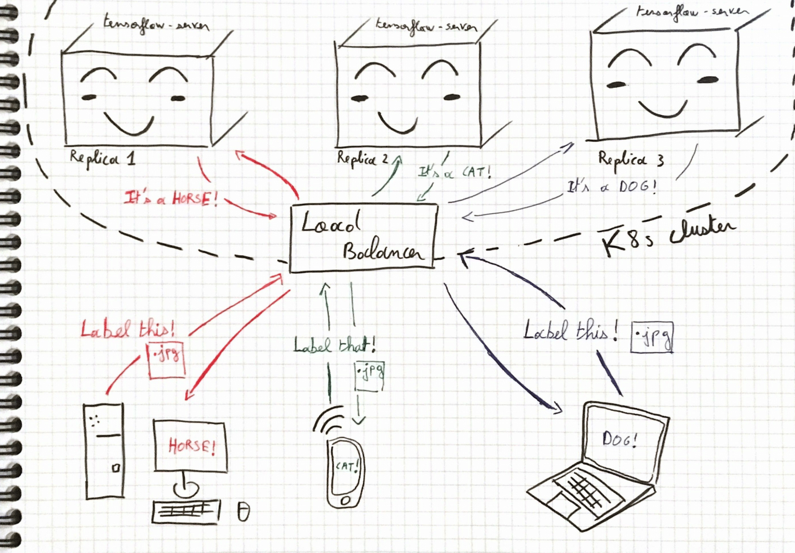
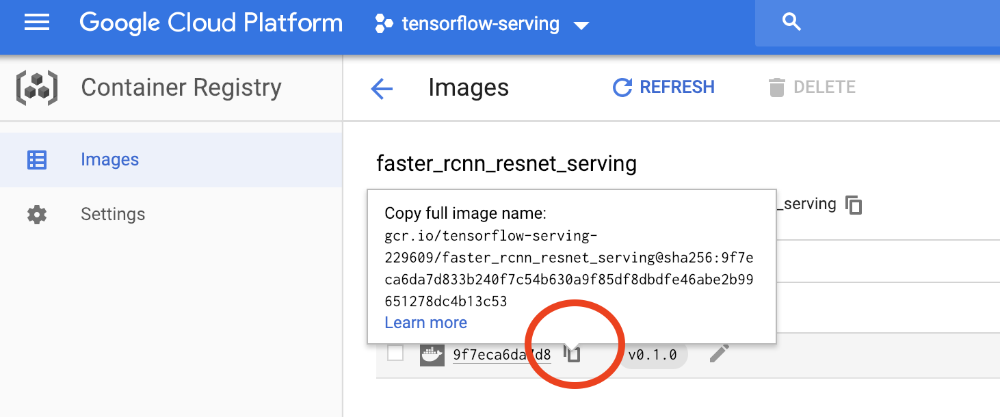
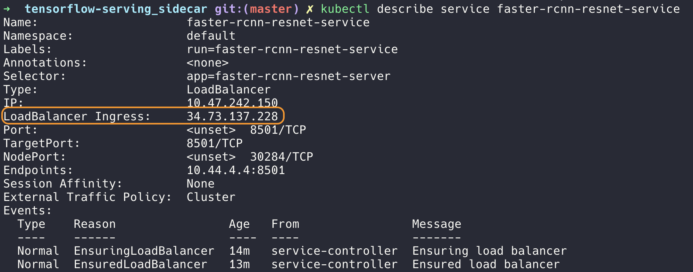

# Deploy a tensorflow-server on the cloud

Previously we saw how to serve a tensorflow model on local. 
One might say, "Great! Let's just run it on a cloud instance, open the correct ports and tada! I am serving my model worldwide!".
This approach may be ok for a testing purpose, or a just side project of yours but I strongly advise against it.
Your server can be easily overwhelmed and security issues will quickly arise. 

In a production setting you want to be sure to scale correctly as the load is increasing on your app. You don't want 
your server to be overwhelmed like in the drawing below:


To avoid this issue, this tutorial will teach you how to use a kubernetes cluster to serve your tensorflow-server app.
The load will be balanced among your replicas without you having to thing about it. 
You want to deploy a new model with no down time? Sure, kubernetes got your back. Perform a rolling update to progressively serve your new model
while gracefully terminating the current requests on the former model.




At the end of this tutorial you will have a kubernetes cluster exposing your model for inference.
To reach this goal, the steps are:
1. Create a docker image with with your `saved_model.pb` file embedded.
2. Deploy in kubernetes.

Alright, let's dive into it

## 1. Create a docker image with with your `saved_model.pb` file embedded.

You remember the docker image we used to run tensorflow-serving and perform inference with our object detection model in our [local example](tf_server_local.md)
shared the model data with the host filesystem. We will now build a self-sufficient image that contains the model.
   
We take the tensorflow-serving base image and add our model in order to deploy on Kubernetes.

### 1.1 Create a custom tensorflow-server image

1. Run a serving image as a daemon:
```bash
docker run -d --name serving_base tensorflow/serving
```

2. Copy the `faster_rcnn_resnet101_coco` model data to the container's `models/` folder:
```bash
# From tensorflow-serving_sidecar/
docker cp $(pwd)/data/faster_rcnn_resnet101_coco_2018_01_28 serving_base:/models/faster_rcnn_resnet
```
3. Commit the container to serving the `faster_rcnn_resnet` model:
```bash
docker commit --change "ENV MODEL_NAME faster_rcnn_resnet" serving_base faster_rcnn_resnet_serving
```
_Note:_ if you use a different model, change `faster_rcnn_resnet` in the `--change` argument accordingly.

`faster_rcnn_resnet_serving` will be our new serving image.
You can check this by running `docker images`, you should see a new docker image:


4. Stop the serving base container
```bash
docker kill serving_base
docker rm serving_base
```

Great, next step is to test the server.

### 1.2 Test the custom server

Before deploying our app on kubernetes, let's make sure it works correctly.

1. Start the server:
```bash
docker run -p 8501:8501 -t faster_rcnn_resnet_serving &
```
_Note:_ Make sure you have stopped (`docker stop <CONTAINER_NAME>`) the previously running server otherwise the port `8501` may be locked.

2. We can use the same client code to call the server.
```bash
# From tensorflow-serving_sidecar/
python client.py --server_url "http://localhost:8501/v1/models/faster_rcnn_resnet:predict" \
--image_path "$(pwd)/object_detection/test_images/image1.jpg" \
--output_json "$(pwd)/object_detection/test_images/out_image2.json" \
--save_output_image "True" \
--label_map "$(pwd)/data/labels.pbtxt"
``` 

## 2. Deploy our app on kubernetes

The following steps are done with Google Cloud Platform - _GCP_. If you are new to GCP, the 300$ free initial credit are more than enough to complete those tasks.
You can create your GCP account there https://cloud.google.com/

Here we assume you have created and logged in a `gcloud` project named `tensorflow-serving`, the detailed GCP setup is detailed in
[gcp_setup.md](gcp_setup.md).

In this section we use the container image `faster_rcnn_resnet_serving` built in Part 1.1 to deploy a serving cluster
with [Kubernetes](https://kubernetes.io/) in the [Google Cloud Platform](https://cloud.google.com/).
 

1. Login to your project, first list the available projects with `gcloud projects list`, select the `PROJECT_ID` of your 
project and run
```bash
# Get the PROJECT_ID, not the name
gcloud projects list 

# Set the project with the right PROJECT_ID, i.e. for me it is tensorflow-serving-229609
gcloud config set project tensorflow-serving-229609
gcloud auth login
```

2. Create a container cluster
 - First we create a [Google Kubernetes Engine](https://cloud.google.com/container-engine/) cluster for service deployment.
Due to the free trial limitation you cannot do more than 2 nodes here, you can either upgrade or go with the two nodes which will be
good enough for our use case. 
 ```bash
gcloud container clusters create faster-rcnn-serving-cluster --num-nodes 2 --zone 'us-east1'
```
You may update the `zone` arg, you can choose among _e.g_: `europe-west1`, `asia-east1` - You check all the zones available with `gcloud compute zones list`.
_Note:_ You are limited to a quota of 8 CPUs in your free trial.


3. Set the default cluster for gcloud container command and pass cluster credentials to [kubectl](https://kubernetes.io/docs/reference/kubectl/overview/).
```bash
gcloud config set container/cluster faster-rcnn-serving-cluster
gcloud container clusters get-credentials faster-rcnn-serving-cluster --zone 'us-east1'
```


4. Upload the custom tensorflow-serving docker image we built previously.
Let's now push our image to the [Google Container Registry](https://cloud.google.com/container-registry/docs/)
 so that we can run it on Google Cloud Platform.

First we tag the `faster_rcnn_resnet_serving` image using the Container Registry format and our project id, change
the `tensorflow-serving-229609` with your project_id.
````bash
docker tag faster_rcnn_resnet_serving gcr.io/tensorflow-serving-229609/faster_rcnn_resnet_serving:v0.1.0

````
if you run `docker images`, you now see an additional `gcr.io/tensorflow-serving-229609/faster_rcnn_resnet_serving:v0.1.0` image.

 
This `gcr.io` prefix allow us to push the image directly to the Container registry,
```bash
# To do only once
gcloud auth configure-docker

docker push gcr.io/tensorflow-serving-229609/faster_rcnn_resnet_serving:v0.1.0
```
You have successfully pushed your image on GCP Container Registry, you can check it online:

 
5. Create Kubernetes Deployment and Service

The deployment consists of 1 replica of faster-rcnn inference server controlled by a [Kubernetes Deployment](https://kubernetes.io/docs/concepts/workloads/controllers/deployment/).
The replicas are exposed externally by a [Kubernetes Service](https://kubernetes.io/docs/concepts/services-networking/service/)
 along with an [External Load Balancer](https://kubernetes.io/docs/tasks/access-application-cluster/create-external-load-balancer/).
 
Using a single replica does not really make sense. I just do so to pass within the free tier.
Load balancing if you have only one instance to direct your query on is 
useless. In a production setup, use multiple replicas.

We create them using the example Kubernetes config [../faster_rcnn_resnet_k8s.yaml](../faster_rcnn_resnet_k8s.yaml).
You simply need to update the docker image to use in the file, replace line  `image: <YOUR_FULL_IMAGE_NAME_HERE>`
with your actual image full name, it looks like something like that:
````bash
image: gcr.io/tensorflow-serving-229609/faster_rcnn_resnet_serving@sha256:9f7eca6da7d833b240f7c54b630a9f85df8dbdfe46abe2b99651278dc4b13c53
````
You can find it in your container registry:

 
And then run the following command
 ````bash
# From tensorflow-serving_sidecar/
kubectl create -f faster_rcnn_resnet_k8s.yaml
````

To view status of the deployment and pods use the `kubectl get deployments` for the whole deployment, `kubectl get pods`
to monitor each replicas of your deployment and `kubectl get services` for the service.


It can take a while for everything to be up and running. The service external `IP` address is listed next to LoadBalancer Ingress.
You can check it with the ``kubectl describe service`` command:
````bash
kubectl describe service faster-rcnn-resnet-service
````


## Query your online model

And finally, let's test this. We can use the same [client code](../client.py).
Simply replace the previously used ``localhost`` in the url with the `IP` address of the LoadBalancer.

````bash
# From tensorflow-serving_sidecar/
python client.py --server_url "http://34.73.137.228:8501/v1/models/faster_rcnn_resnet:predict" \
--image_path "$(pwd)/object_detection/test_images/image1.jpg" \
--output_json "$(pwd)/object_detection/test_images/out_image3.json" \
--save_output_image "True" \
--label_map "$(pwd)/data/labels.pbtxt"
````
________
### Resources 


- More resources on Docker `bind` mount is available on [Docker bind official docs](https://docs.docker.com/storage/bind-mounts/).
- To understand how the docker `commit` command works, refer to the [Docker commit official doc](https://docs.docker.com/engine/reference/commandline/commit/).
- Google Container registry documentation, https://cloud.google.com/container-registry/docs/