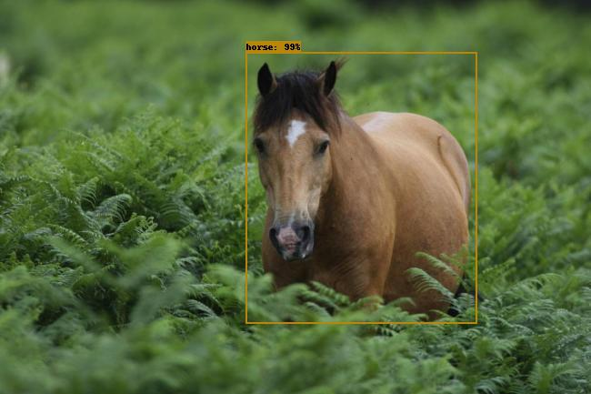

# Serve your machine learning model with `tensorflow-serving`

This project provides material to serve your tensorflow models with `tensorflow-serving`. I describe installation steps
to quickly get up and running. You will learn how to serve an object detection model on with tensorflow serving, 
first on local and then on cloud instances. 

## Install the project

The installation process is thoroughly described in the [docs/setup.md](docs/setup.md). It covers everything you need to do
prior being able to serve a model with tensorflow-serving.

## Create a local tensorflow server and make your first API call

This will help you make sure you installed everything correctly. 

1. Run the tensorflow server, pay attention to forward the port `8501` and bind the correct path.
Fine tune the `-v` arg if you use a different model.
```bash
# From tensorflow-serving_sidecar/
docker run -t --rm -p 8501:8501 \
   -v "$(pwd)/data/faster_rcnn_resnet101_coco_2018_01_28:/models/faster_rcnn_resnet" \
   -e MODEL_NAME=faster_rcnn_resnet \
   tensorflow/serving &
```

2. Call the server to perform an inference. Fine tune the `--server_url` argument if you use a different model.
The `client.py` script is a very simple script to pre-process the input image, perform the API call, and process the server's output. 
It returns detections score and build the annotated image. 

```bash
# From tensorflow-serving_sidecar/
python client.py --server_url "http://localhost:8501/v1/models/faster_rcnn_resnet:predict" \
--image_path "$(pwd)/object_detection/test_images/image1.jpg" \
--output_json "$(pwd)/object_detection/test_images/out_image1.json" \
--save_output_image "True" \
--label_map "$(pwd)/data/labels.pbtxt"
```

If everything works fine you should have an image generated under `object_detection/test_images/out_image1.jpeg`.
With the provided model and example it should look like:
 


----

## Credits

The `object_detection` directory comes from the
[tensorflow-model](https://github.com/tensorflow/models) repository. 
It offers useful `utils` functions to tag the image returned from the model.

Feel free to investigate the models on the `tensorflow-model` repo since they are well documented and often provide tutorials to fit your needs.

